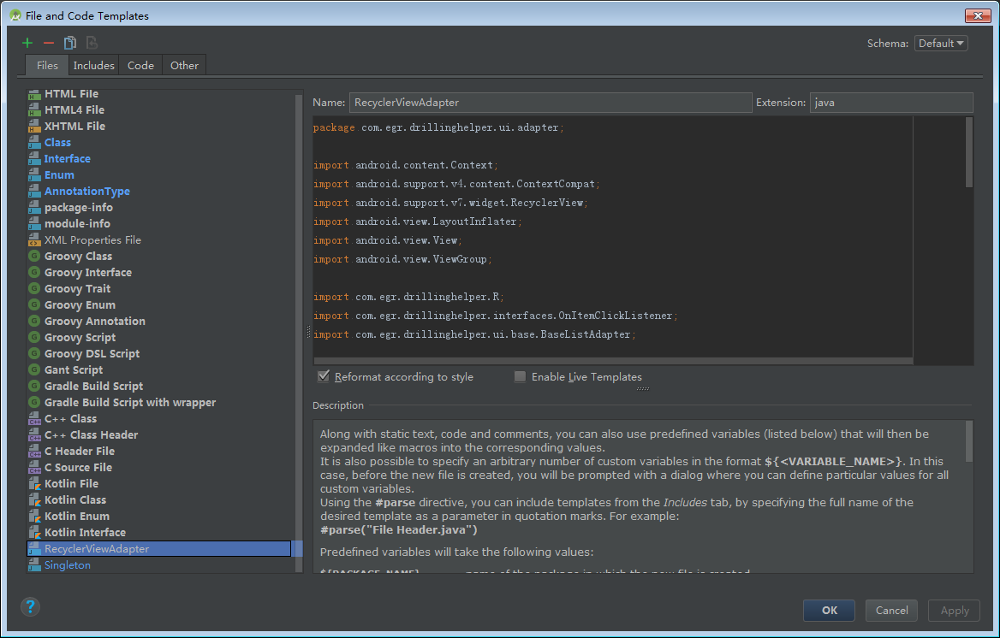

# AndroidTemplates
## [MVPActivity](https://github.com/LvZhenDong/AndroidTemplates/tree/master/MVPActivity)
快速创建一个MVPActivity，会生成对应的Contract、Model、Presenter、layout文件，且自动添加到AndroidManifest.xml
## [MVPFragment](https://github.com/LvZhenDong/AndroidTemplates/tree/master/MVPFragment)
同MVPActivity
## [File](https://github.com/LvZhenDong/AndroidTemplates/tree/master/File)
由于不知道File and Code Templates窗口里的Templates代码具体的文件位置，所以如果要用这里的代码只能去File→New→Edit File Templates... 中新建Template

